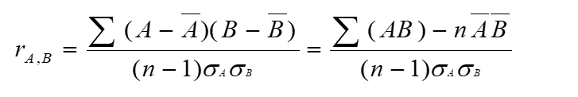
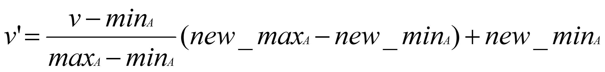
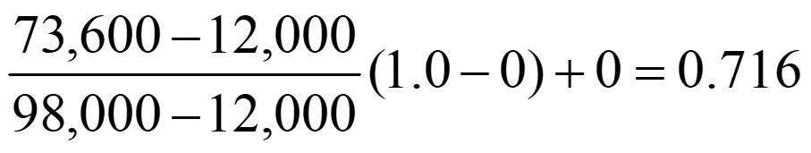
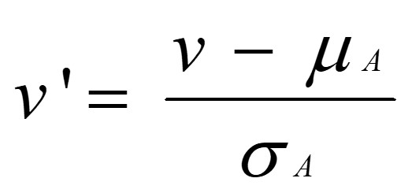
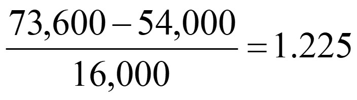
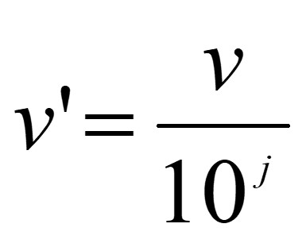

# Data Mining

## Data cleaning

Fill in missing values, smooth noisy data, identify or remove outliers, and resolve inconsistencies

Importance

- _Data cleaning is one of the three biggest problems in data warehousing_—Ralph Kimball
- _Data cleaning is the number one problem in data warehousing_—DCI survey

Data cleaning tasks

- Fill in missing values
- Identify outliers and smooth out noisy data
- Correct inconsistent data
- Resolve redundancy caused by data integration

Missing data may be due to

- equipment malfunction
- inconsistent with other recorded data and thus deleted data not entered due to misunderstanding
- certain data may not be considered important at the time of entry
- not register history or changes of the data

How to Handle Missing Data?

- Ignore the tuple: usually done when class label is missing (assuming the tasks in classification—not effective when the percentage of missing values per attribute varies considerably.
- Fill in the missing value manually: tedious + infeasible?
- Fill in it automatically with
  - a global constant : e.g., “unknown”, a new class?!
  - the attribute mean
  - the attribute mean for all samples belonging to the same class: smarter
  - the most probable value: inference-based such as Bayesian formula or decision tree

Noise: random error or variance in a measured variable

- Incorrect attribute values may due to
  - faulty data collection instruments
  - data entry problems
  - data transmission problems
  - technology limitation
  - inconsistency in naming convention

Other data problems which requires data cleaning

- duplicate records
- incomplete data
- inconsistent data

How to Handle Noisy Data?

- Binning
  - first sort data and partition into (equal-frequency) bins
then one can smooth by bin means,  smooth by bin median, smooth by bin boundaries, etc.
- Regression
  - smooth by fitting the data into regression functions
- Clustering
  - detect and remove outliers
- Combined computer and human inspection
  - detect suspicious values and check by human (e.g., deal with possible outliers)

Simple Discretization Methods: Binning

- Equal-width (distance) partitioning
  - Divides the range into N intervals of equal size: uniform grid
if A and B are the lowest and highest values of the attribute, the width of intervals will be: W = (B –A)/N.
  - The most straightforward, but outliers may dominate presentation
  - Skewed data is not handled well
- Equal-depth (frequency) partitioning
Divides the range into N intervals, each containing approximately same number of samples
  - Good data scaling
  - Managing categorical attributes can be tricky

## Data integration

Integration of multiple databases, data cubes, or files

Combines data from multiple sources into a coherent store

- Schema integration: e.g., A.cust-id  B.cust-#
  - Integrate metadata from different sources
- Entity identification problem:
  - Identify real world entities from multiple data sources, e.g., Bill Clinton = William Clinton
- Detecting and resolving data value conflicts
  - For the same real world entity, attribute values from different sources are different
  - Possible reasons: different representations, different scales, e.g., metric vs. British units

Handling Redundancy in Data Integration

- Redundant data occur often when integration of multiple databases
  - Object identification:  The same attribute or object may have different names in different databases
  - Derivable data: One attribute may be a “derived” attribute in another table, e.g., annual revenue
- Redundant attributes may be able to be detected by correlation analysis
- Careful integration of the data from multiple sources may help reduce/avoid redundancies and inconsistencies and improve mining speed and quality

### Correlation Analysis (Numerical Data)

- Correlation coefficient (also called Pearson’s product moment coefficient)

where n is the number of tuples,       and      are the respective means of A and B, σA and σB are the respective standard deviation of A and B, and Σ(AB) is the sum of the AB cross-product.

- If rA,B > 0, A and B are positively correlated (A’s values increase as B’s).  The higher, the stronger correlation.
- rA,B = 0: independent;  
- rA,B < 0: negatively correlated

### Χ2 (chi-square) test

test.png "Χ2 (chi-square) test")

- The larger the Χ2 value, the more likely the variables are related
- The cells that contribute the most to the Χ2 value are those whose actual count is very different from the expected count
- Correlation does not imply causality

  - \# of hospitals and # of car-theft in a city are correlated
  - Both are causally linked to the third variable: population

## Data transformation

Normalization and aggregation

- Smoothing: remove noise from data
- Aggregation: summarization, data cube construction
- Generalization: concept hierarchy climbing
- Normalization: scaled to fall within a small, specified range
  - min-max normalization
    - Min-max normalization: to [new_minA, new_maxA]
    - 
    - Ex.  Let income range $12,000 to $98,000 normalized to [0.0, 1.0].  Then $73,000 is mapped to 
  - z-score normalization
    - 
    - Ex. Let μ = 54,000, σ = 16,000.  Then 
  - normalization by decimal scaling
    -  Where j is the smallest integer such that Max(|ν’|) < 1

- Attribute/feature construction
  - New attributes constructed from the given ones

## Data reduction

Obtains reduced representation in volume but produces the same or similar analytical results

- Why data reduction?
  - A database/data warehouse may store terabytes of data
  - Complex data analysis/mining may take a very long time to run on the complete data set
- Data reduction
  - Obtain a reduced representation of the data set that is much smaller in volume but yet produce the same (or almost the same) analytical results
- Data reduction strategies
  - Data cube aggregation:
  - Dimensionality reduction — e.g., remove unimportant attributes
  - Data Compression
  - Numerosity reduction — e.g., fit data into models
  - Discretization and concept hierarchy generation

## Data discretization

Part of data reduction but with particular importance, especially for numerical data
